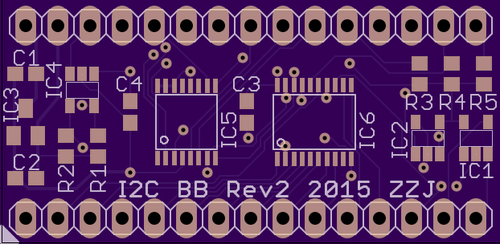

<h3>Breakout board w/  I2C controller PCA9665</h3> 
 
 <a href="https://oshpark.com/profiles/ZigZagJoe"> Order PCB here!</a>  <b>Features:</b> 
100khz to 1mhz I2C bus 
5V-tolerant I/O 
3.3v VCC 
68 byte buffer  
30 pins (2x15),  0.1" spacing,  0.6" pin width 2 layer, 1.55" x 0.76" (39.37x19.20 mm) 

<h4>Optional parts:</h4>
<b>3.3v regulator MCP1700</b>, 3.5v-6v Vin, 250ma 

<b>I2C-SPI bridge SC18IS602</b> 
<b>I2C ADC MCP3221A</b>, 1ch, 12bit 
<b>I2C EEPROM</b>, SOT23-5 
<b>OC driver for /CS -> /DTACK</b> 

 <b>Changelog</b> 
<b>Rev2:</b> Fixed ADC layout (transposed Vcc and Gnd) 
