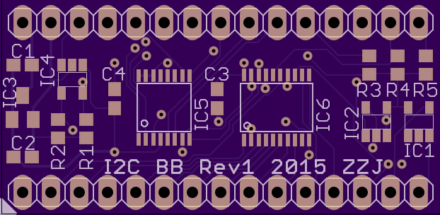

<h3>Breakout board w/  I2C controller PCA9665</h3>   <b>Features:</b> 
400khz I2C bus 
1.8mhz SPI w/ 0-4 SS lines 
0-4 GPIOs 
12bit ADC with peak read rate of 22.3 ksps 
8kb EEPROM 
Onboard 3.3v regulator, 250ma 
5V-tolerant I/O 
 
3.5v-6v Vin, or 3.3v via pin 29 
30 pins (2x15),  0.1” spacing,  0.6” pin width  

<b>I2C bus:</b>
<ul>
<li>addr 47, I2C-SPI bridge SC18IS602</li>
<li>addr 77, 1ch 12bit ADC MCP3221A</li>
<li>addr 80, 8kb EEPROM</li>
</ul>
